```{r setup, include=FALSE}
library(tidyverse)
knitr::opts_chunk$set(echo = TRUE)
```
# はじめに

- このスライドはhtml形式で保存しています
  - 左下のハンバーガーアイコンをクリックすると各ページに飛べます
  - ただ、PC以外の方法で閲覧するのはちょっと不便
- ファイルをpdfで保存することができます
  - ブラウザURLの末尾の"\~html"の後ろに"?print-pdf"を付け、ページを印刷するとpdf形式で保存できます
  - 紙に印刷して見たい、単純に見づらいからpdfで閲覧したいという方はどうぞ

# R言語を使う

- R言語とは？
- Rでできること
  - 研究・分析のフロー
- R言語の基本構造

## R言語とは？

- "*R is a free software environment for statistical computing and graphics*"<br>(from [The R Project for Statistical Computing](https://www.r-project.org/))

    - 統計計算、グラフ作成を行うことができる無料のツール
    - データの収集、管理、分析から結果の出力・プレゼンテーションの作成までを一つの言語で行うことも出来る
    - この資料もRを使って作成(R Markdown)

- 目標

    - 今回は、Rの基本的な操作方法を学習した上で、論文執筆の上で最低限必要なアウトプットのための技術習得をめざす

## Rでできること

- データの操作

    - データの取得：デフォルトのデータセット、csvファイル等の読み込み
    - データの整理：必要な情報の抽出、データの変形、新たな変数の作成と保存

- データの要約・可視化

    - 基本統計量の作成
    - 変数間の関係を視覚的に描写：graphics, ggplot2

- データ分析

    - 計量経済学・統計学で用いられる様々な手法の実装
    - 結果の出力

- レポートの作成

    - 分析結果をスライドにして報告 RMarkdown

        - Word, Powerpoint形式でファイルを出力

    - 出力の保存や体裁を整える手間が削減できる
    
## データの操作

- 利用するデータの読み込み

```{r, out.width="70%", echo=FALSE, fig.align='center'}
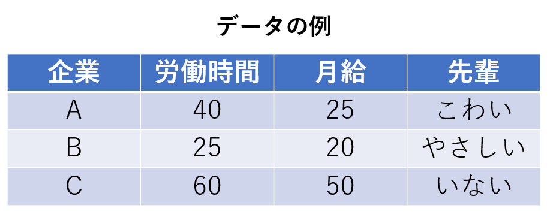
```

- データを加工する

  - 欲しい行だけ抜き出す、欲しい列だけ抜き出す
  - 元データの情報を使って、分析のための新しい変数を作る
  - 例えば、人口50万人以上の都市に1, それ以外に0を入れる「大都市ダミー」を作成する


## データの要約・可視化

- 要約統計量の作成

```{r, out.width="80%", echo=FALSE, fig.align='center'}
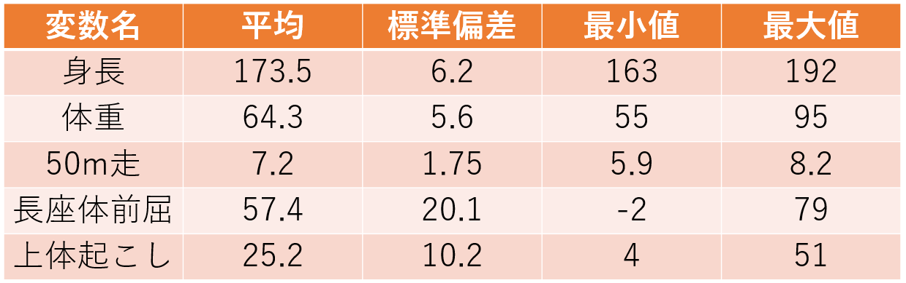
```

- データの概要を示す：各変数の平均・標準偏差など
- 性別ごと、年代ごとなど、カテゴリで分けて表示する場合も
- 可視化できるデータは可視化すると分かりやすい

## 可視化されたデータの例

```{r, warning=FALSE, fig.align='center', fig.height=4, fig.width=6}
df <- palmerpenguins::penguins
ggplot2::ggplot(df) +
  ggplot2::aes(x = body_mass_g, y = bill_length_mm, fill = species) +
  ggplot2::geom_point(colour = "black", shape = "circle filled") +
  ggplot2::scale_fill_viridis_d() +
  ggplot2::theme_bw()
```


## データ分析

- 回帰分析などの統計手法による分析を行い、結果をまとめる

$$\text{weight}_{i} = \text{flipperSize}_i + \text{Spiecies}_i + u_i$$
  
```{r, out.extra="70%", echo=FALSE}
df %>%
  lm(formula = body_mass_g ~ flipper_length_mm + species, data = .) %>%
  summary()
```

## レポートの作成

- Rで行った分析の結果を、Wordやパワーポイントにまとめて出力、保存できる
- 習熟度によってはそのまま論文を書くことも可能、そこまでいかずとも色々と手間が省けて便利

## おまけ：データの取得

- Rでは様々なデータセットを
- ウェブサイトから情報を収集して分析を行いたい場合がある
- Rのコードからウェブサイトを開き、中の要素を分析に使えるデータセットとして出力することができる

## 基本構造

- 基本的には、というか全ての命令は

    - Rに命令を投げる→命令に従って計算(描画・読み込みなど)を行う

    - 必要であればアウトプットを返す

    の繰り返し

- エレベーターの3階ボタンを押す→3階に向かう、ドアを開ける

    - ボタンを押すエネルギーでエレベータが動いているわけではない
    - ワイヤーをどれだけ巻き取ればどれだけ上昇・下降するのか、ドアを開けるためにどの部分にどれだけ力を加えればいいのか、が3回ボタンを押したときに発せられる命令として書かれている

- この命令を一つ一つ書く作業を行う

- ExcelやWordなどのソフトウェアでは、こうした命令をコードを書く代わりにボタン操作などでまとめて行ってもらっている

## 参考

- 立命館大：森先生のサイトが大変勉強になります
  - [卒業論文のためのR入門](https://tomoecon.github.io/R_for_graduate_thesis/)
- その他、分からないことはgoogleする力を付けましょう
  - "r (関数名)"とかで大体載ってます
  - GitHubなどで自身の作成したライブラリや関数の使い方などを解説しているものも多数存在
- [R Tips](http://cse.naro.affrc.go.jp/takezawa/r-tips/r.html)
- [RjpWiki](http://www.okadajp.org/RWiki/)

## その他

- ショートカット：マウスを極力使わない→作業効率の改善
- 共通の操作
  - Ctrl + X, C, V：順に切り取り・コピー・貼り付け
  - Ctrl + A：全範囲を選択
  - Ctrl + Z, Y：操作を戻す・進める
  - Ctrl + F：ウィンドウ内検索
  - Ctrl + S：(上書き)保存
- R Studio内の操作
  - Ctrl + Shift + N：新しいスクリプトを開く
  - Ctrl + O：保存したファイルを開く(Studio以外でもだいたい使える)
  - Ctrl + W：タブを閉じる(Chromeとかブラウザも同じ)
  - Ctrl + Q：R Studioの終了
- Word, PowerPoint, Excelを扱うときもできるだけマウスを使わない
  - 慣れると作業効率がだいぶ変わる

# Setup

- Rでの作業に使うもの
  - 開発環境とは、R Studioのすすめ
- インストール
- 基本操作画面

## Rでの作業に必要なもの

- **R言語**と**R Studio**の2つをインストール
  - R言語をスムーズに利用するためのツール：開発環境がRStudio
  - デフォルトでR GUI と呼ばれる開発環境がインストールされるが、色々な理由から使いづらい
    - 罫線の引いてあるノートに書くか、自由帳に書くかみたいな違い
    - 最終的にR言語で命令を書くのは同じ
  - その他にも Jupyter Notebook, VS Code, Atomなど様々な開発環境があるので、好きなものを使えばよい
- R Studio Cloud: クラウド上でR Studioの機能を利用できるサービス
  - 無料の場合は月あたりの利用時間が制限されるなど問題はあるが、特に自前PCのない人は検討してみてもよいかも
  
## RとR Studio

```{r, out.width="95%", echo=FALSE, fig.align='center'}
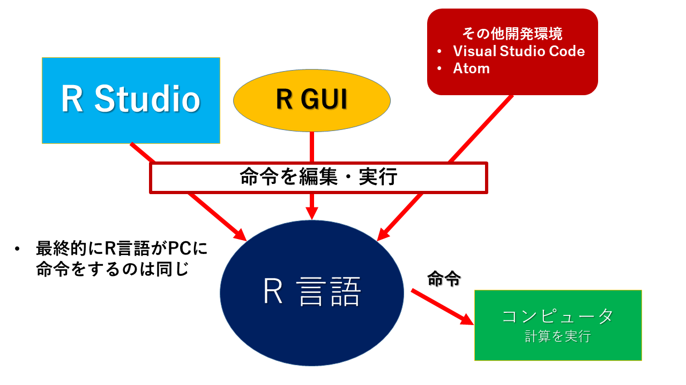
```

## インストール

[Rのダウンロードはここから](https://cran.ism.ac.jp/)

[RStudio Desktop](https://www.rstudio.com/products/rstudio/download/#download)

- 【定期】詰まったら4回生に訊いて下さい
- それぞれ必ず最新バージョンをダウンロードすること
  - 定期的にアップデートしておくのがおすすめ、たまに関数の仕様とかが大幅に変わる
  - たぶんいないと思いますが、Ver.4.0.0以前のものを使用している4回生はインストールし直して下さい
- Cドライブに日本語フォントが含まれている人
  - C:/Users/.../...のところ
  - ファイルの保存などする際に非常に面倒なことになります
  - 特に動作で問題が出なければいいですが、コードの実行中に止まるなどあれば相談して下さい
  - 今から買う人は絶対に日本語フォントを入れないようにしましょう、一生

## R Studioの基本画面

- 4つの画面 (Pane)が表示される: コードを入力するのは Source, Consoleの2つ
  - Source：Rスクリプトなどを編集・保存
  - Console：実行するコードを直接入力・実行できる。
  - 右側の Pane では読み込んだデータフレームやオブジェクトの定義確認、図表出力のチェックなどが行える
  
```{r, out.width="77%", echo=FALSE, fig.align='center'}
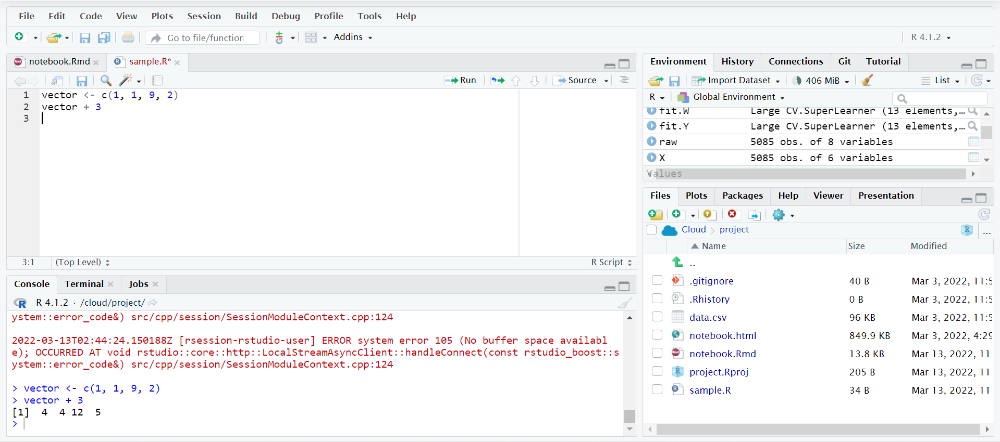
```

## 触ってみる

- コンソールに適当なコードを入力してみよう

```{r}
1 + 3 + 5
```

- コンソールではEnter, ソース(スクリプト)ではCtrl + Enterでコードを実行する
- 出力は>に続いて出る(文字色が変わるので分かりやすいはず)
- このスライド上では、コード、出力を四角囲みで、うち出力を##に続く形で表現する

# プロジェクトの作成、バージョン管理

- ディレクトリとは
- ディレクトリの構造
- フォルダの共有方法
- R Studioでプロジェクトを作成する方法

## ディレクトリ

- ファイルやフォルダを参照する際に示すPC内の**住所**
  - C:/...がそれ
  - 全てが同じ階層に入っているのは作業こそ楽だが、自分で参照するときに探すのが面倒
    - ゼミ論文に使うdata.csvというファイルを保存→他の講義で同じ名前のファイルを受け取る→後から見たらどれがどれだか分からなくなる
- 整理の方法: 作業やファイルの種類ごとにフォルダを作り、異なる系統のファイルを識別
  - 何をする作業のフォルダなのか？
  - データの種類：整理する前の生データなのか、そのまま分析に使えるデータなのか？
  - アウトプット: 分析結果、図表
- R Studioでは、特定のフォルダを「プロジェクト」として扱い、「誰のPCでも動くコード」を作ることができる

## ディレクトリの構造

```{r, out.width="77%", echo=FALSE, fig.align='center'}
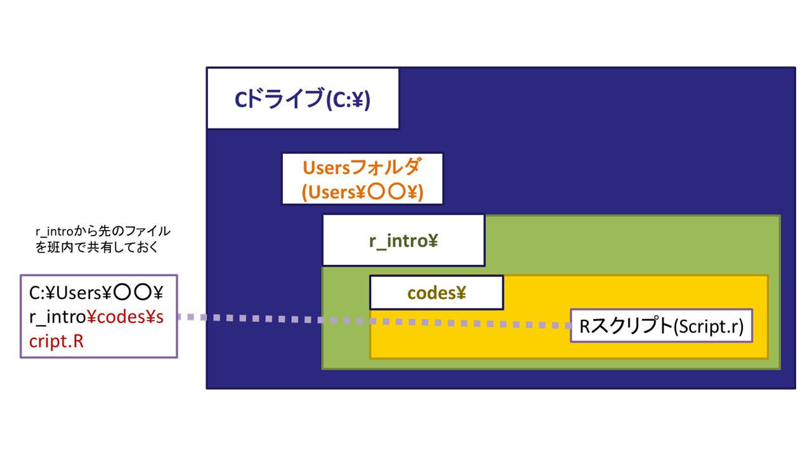
```

- 使いやすいフォルダの作成
  - 各自のPCで"r_intro"フォルダを作り、必要なファイルをしまっておけば、誰が書いたコードでも個々人がPCで再現できる環境に
  - フォルダ名は\\(バックスラッシュ, ￥)を/ (スラッシュ)に変えて記述
  
## フォルダ

```{r, out.width="95%", echo=FALSE, fig.align='center'}
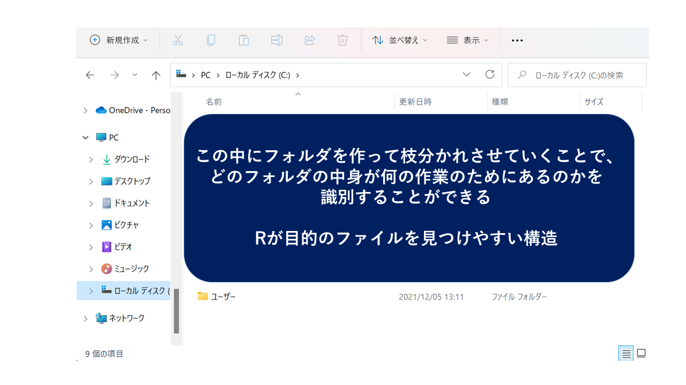
```

## フォルダ (cont'd)

```{r, out.width="95%", echo=FALSE, fig.align='center'}
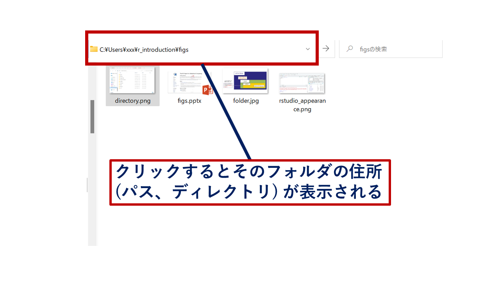
```

## ワーキングディレクトリの確認と変更

- ワーキングディレクトリ：Rが見ているフォルダ
  - CSVなどのファイルを読み込む際は、このフォルダから指定された名前のファイルを探す
- R Studioのプロジェクトを利用している時は、そのフォルダがある場所がワーキングディレクトリ
- `getwd`関数で今のワーキングディレクトリを確認できる
  - `setwd`で変更できるが、基本的には相対パスで指定した方が再現性が高いのでおすすめ
- ファイル名：基本全て""で囲む、ワーキングディレクトリの中にあるフォルダを開きたい場合は/で区切る
  - `"C:/folder1/folder2/data.csv"`

## 拡張子

- PC上で扱うファイルには、それがどのアプリケーション(ソフト)で利用するものなのかがPC側に伝わる印が付いていることが多い：拡張子
  - 例えば.csvはMicrosoft Excelで開くと決めている(既定のアプリ)
  - .RはRスクリプトを表すことが分かるのでR StudioやR GUI、.htmlはブラウザで開く
  - R Studio、Excelのそれぞれでcsvファイルを開いてみよう
  
## フォルダの共有方法

- フォルダの共有：データや書いたスクリプトを共有する
  - 何度も修正を加えたり、作った図表を共有するのはめんどい
  - 結果、分析をした人がスライドも全部作る…になりがち
- フォルダをメンバー間で同期する(共有する)ツールをマスターすると、グループでの作業が楽になる
  - [Dropbox](https://www.dropbox.com/)
  - [GitHub](https://github.com/)
  
- 特にGitHubはRStudioと直接連携して簡単にクラウド共有・共有したデータのダウンロードも可能なので非常に便利
  - データをオープンで保有することになるので、扱うデータの種類によっては注意が必要

## フォルダの共有方法(cont'd)
  
- Google Driveを使う方法もあり
  - Google Document, Spreadsheet, Slides を使った論文共同執筆はべんり
  - OfficeのWord, Excel, Powerpointに比べると機能がかなり制限される弱点
  - 特にスライド作成に関しては不便なポイントが多いかも
- 文面はGoogle Driveで共有しながら作成しつつ、体裁を適宜Wordにダウンロードするなどして修正する必要がある

## プロジェクトの作り方

```{r, out.width="95%", echo=FALSE, fig.align='center'}
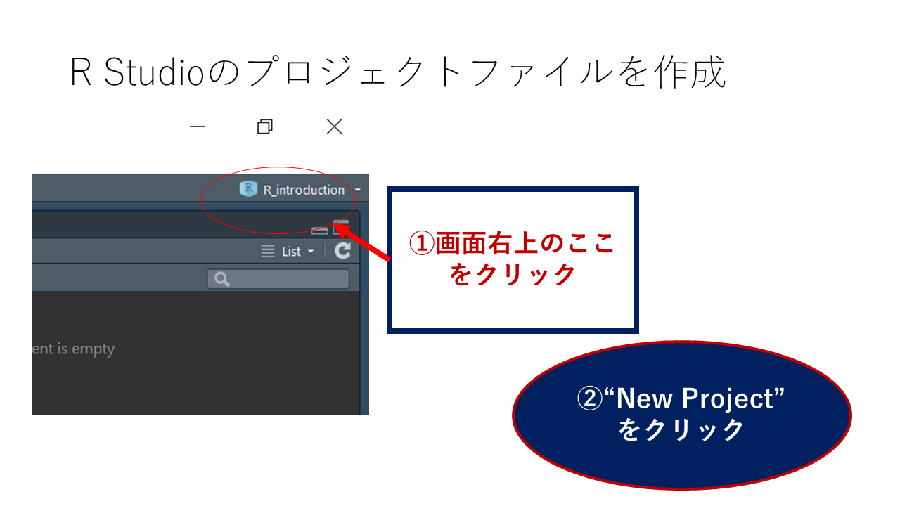
```

## プロジェクトの作り方(cont'd)

```{r, out.width="95%", echo=FALSE, fig.align='center'}
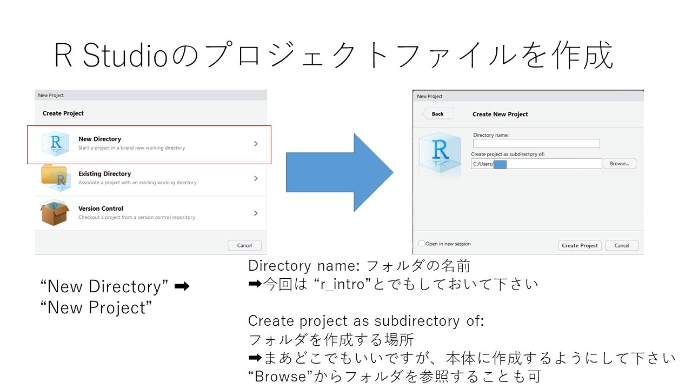
```

## ディレクトリの管理

```{r, out.width="95%", echo=FALSE, fig.align='center'}
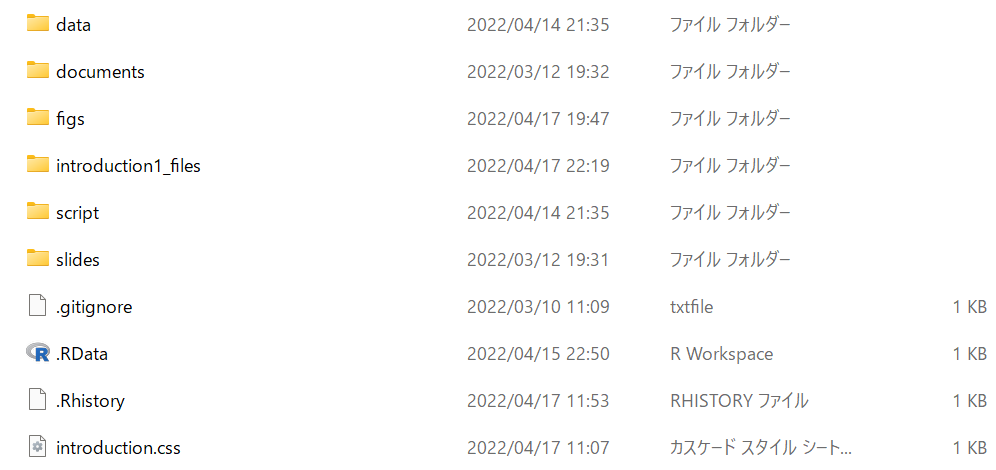
```

- 元データ、Rスクリプト、作成した画像や表…など、作ったものをフォルダで整理すると便利

# 基本操作

- コンソールに数値を打ち込む、計算する
- スクリプトの作成
- 変数の型
- オブジェクトに数値などを割り当てる
- 値を束にして扱う

## 入力画面

- コンソール(通常左下)の">"が入力待ち状態を表す
- 命令を書いてEnterキーを押すと実行できる

```{r, out.width="95%", echo=FALSE, fig.align='center'}
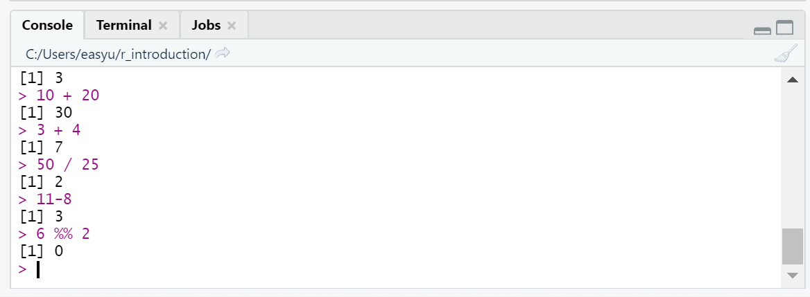
```

## スクリプトの作成、演算子

- "r_introduction"というプロジェクトを作成

- R Studioを開く
  - R Consoleにコードを直接入力してEnter、もしくはRスクリプトにコードを記述してCtrl + Enterで実行
  - RスクリプトはCtrl+Shift+Nで作成可能
  - Ctrl + Sで保存、上書き保存

```{r K3}
1 + 2 * (3 / 4) # 掛け算は*で
```

- その他、基本的な演算記号は[R-Tips](http://cse.naro.affrc.go.jp/takezawa/r-tips/r.html)などを参照

## Source: スクリプトやマークダウンファイルの編集

```{r, out.width="95%", echo=FALSE, fig.align='center'}
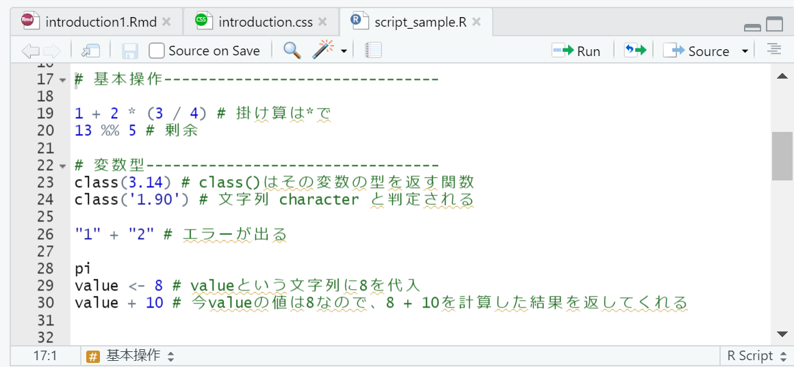
```

- Ctrl + Enterで選択箇所のコードを実行
- 長いコードを途中で改行できることも利点
- Ctrl + Sで適宜上書き保存できる

## 変数の型

- 数値だけでなく、文字も扱うことができる
  - 何を使っても良いわけではない：Excelも一緒
    - 電話番号を入力したのに頭の0が消える→Excelが電話番号を数値として認識してしまっているから
    - Excelの場合、数値の形式を標準(Excelに自己判断させる)から文字列に変更することで対処
  - 文字列を""で囲って表記することで、それが文字列であることをRに伝えることができる
  - class関数(関数については後述)を使うと、その値の型が分かる
```{r class}
class(3.14) # class()はその変数の型を返す関数
class('1.90') # 文字列 character と判定される
```

## 変数の型(cont'd)

- numeric, integerは足し引きできるが、characterはできない
  - integerは整数
```{r character, eval=FALSE}
"1" + "2" # エラーが出る
```

```{r}
class(11L) # 整数の後ろに"L"を付けると整数として認識される
```
## 変数の型(cont'd)

- factor
  - 順序が付いた文字列
  - factor()で定義
  - アルファベット順や数字順以外の方法で並べたい場合に使う
  - まあ使うときにやればいいとおもいます
```{r}
factor(c("January", "February", "March", "April")) # アルファベット順に並んでしまう
factor(c("January", "February", "March", "April"), 
       levels = c("January", "February", "March", "April"))
```
  

## オブジェクト

- では""で囲わずに入力した文字列はどう認識されるのか？
  1. 特定の値と結びついている
    - `pi`: 円周率
  2. 自信が定義した任意の値が格納されている
    - オブジェクト: 数値やベクトル、データフレームやリストを格納、R Studioでは右上のEnvironmentタブに定義が表示される
    - 回帰分析などの計算結果を格納することも可能
    - `<-` を使って適当な値を定義する
    - `wani <- 3`：waniというオブジェクトに値3を格納
- R Studioでは Environmentに定義したオブジェクトの中身が表示される    

## オブジェクトの定義
```{r}
pi # デフォルトで円周率が格納されている
value <- 8 # valueという文字列に8を代入
value + 10 # 今valueの値は8なので、8 + 10を計算した結果を返してくれる
```

## 値を束にして扱う

- ぶっちゃけ、$5 \times 5$ぐらいの計算なら電卓でやればよい
- R、というかPCで計算ができる強みは、複数の計算や結果の保存を同時に行うことができる点
  - 人間の頭は複数の計算を同時に扱えない
  - 計量分析を行う上で不可欠な行列計算などと相性が良い
- Rには複数の数値を扱うための束を作る記法が存在する
  - ベクトル：複数の値を順番付きで格納
  - 行列、データフレーム：行方向と列方向に展開、ベクトルを束にしたものともいえる
  - リスト：行列やデータフレームを束にして扱うことができる

## ベクトル

- ベクトル：複数の要素を含む列
  - `c(a, b, c, ...)`で定義される
  - 文字列など、他の数値型を利用してもOK
```{r}
vec <- c(1192, 2960)
vec * 2
```

- 関数(後述)を用いて規則性のあるベクトルを簡単に定義することもできる
  - `seq(a, b, c)`: aからbまで、公差cの等差数列
    - 公差が1の場合は、`a:b`でも代替可能
  - `rep(a, b)`: aをb回繰り返す数列
```{r}
seq(1, 10, 2)
```

## データフレーム

- 各行に観測単位(個人、グループ、都道府県など)、各列に特定の情報を含んだデータ形式
  - 実際にデータ分析を行う際は、csvファイルなどをこの形式で読み込むことでRで扱えるようにする
- 100人の性別、学年、学部が分かるデータフレーム：100行×3列のデータフレームになる

- データフレームは`data.frame`関数、もしくはtibbleパッケージの`tibble`関数で定義する

## データフレーム (cont'd)

```{r, eval=FALSE}
library(tidyverse) # パッケージを起動
```

```{r}
df <- tibble::tibble( # dfというオブジェクトにデータフレームを定義
  faculty = c("econ", "law", "foreign", "lit"), # 各列のデータをベクトル形式で代入
  grade = c(4, 2, 1, 1),
  toeic = c(300, 820, NA, 785) # NA: 該当する値が存在しないことを表す＝無回答など
)
print(df)
```

## 定義したデータフレームの確認

```{r, out.width="80%", echo=FALSE, fig.align='center'}
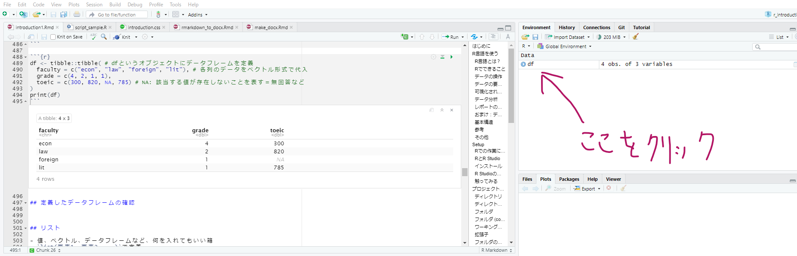
```

## リスト

- 値、ベクトル、データフレームなど、何を入れてもいい箱
- `list(要素1, 要素2, ...)`で定義
- 複数のデータフレームに対して同じ操作をしたい場合などに便利

```{r}
listA <- list(data.frame(a = 1:5, b = 11:15, c = 100:104), df)
print(listA)
```

## リスト (cont'd)

```{r}
print(listA[[1]]) # リストの中の一部の要素のみ利用する場合は、[[]]で指定する
```

- あんまり便利さが伝わらなさそうなので分析パートで後述

## 関数

- Rで行う典型的な操作・計算を行う命令
- 操作を実行する対象となる値や、実行にあたって選択可能な様々なオプションを(関数名)(引数1 = ., 引数2 = ., ...)の形で記述
```{r}
log(x = 100, base = 10) # 100の対数、底10で計算
log(x = 100, base = 5) # 底を5に変更
```

## 関数 (cont'd)
- 各関数において使用される引数の名前は決まっており、必要なオプションに対して一つひとつ情報を指定する
  - 引数には数値や文字列を取ったり、ベクトルやデータフレームを取る時もある
- 引数を指定しなければエラーが出るものと、指定しない場合のオプションを自動で選んでくれるものとが存在
- パッケージ名::関数名()でその関数がどのパッケージに属しているかを明示することもできる
- 実行結果のエラー
  - エラー：引数指定の不備などで計算が実行できなかった場合
  - 警告(warning)：引数を自動補完した、計算結果に不備があるなどしたが、とりあえず結果は出た
  
## 関数とベクトル

- 関数の引数にベクトルやデータフレームを使用するのももちろん可能
- `mean`関数、`sd`関数は、それぞれ値の平均、標準偏差を計算する関数

```{r}
values <- c(1:5, rep(3, 10), 4:10) #1, 2, ..., 5, 3, 3, ... 
mean(values) # ベクトルの平均を計算
sd(values)
```

  
## パッケージの利用

- パッケージ：便利な関数をまとめて利用可能にする関数のセット
- 世界中のプログラマーが様々な分野における分析やデータ収集に関するパッケージを開発・公開している
  - これらを全て無料でダウンロードし、利用できるのがRの強み
- `install.packages`関数を用いてCRAN(公式のインストールサイト)からインストール
- その他、Githubにパッケージを公開している人もいるので、その場合は別の関数を利用
- インストールしたパッケージは、毎回Rの起動時に`library`関数、もしくは`require`関数を用いて有効化する
```{r, eval=FALSE}
install.packages("tidyverse") # tidyverse パッケージをインストール
library(tidyverse) # tidyverse パッケージを有効化：起動したときに毎回実行する
```

## 例：図形の描画

- $y = x^2$のグラフの描画、定義域は-5から5
- pchはプロットの形を指定、colはプロットの色

```{r, out.width="47%", fig.align='center'}
graphics::plot(x = -5:5, y = (-5:5)^2, pch = 19, col = "magenta") 
```

# データ操作

- tidyverse パッケージの活用
- R内のデータセットを利用する
- データの中身を確認する
- csvファイルの読み込み、保存
  - csvファイルを保存する
  - PCに保存したデータを読み込む
  - ネットで公開されているcsvファイルを読み込む
  - その他のデータ形式
- データの詳細を調べる
  - サイトの参照
  - 要約統計量の作成：データの概観を掴む
- データを操作する
  - 不要な行・列の削除
  - サンプルの分割
  - 新しい列の作成・条件分岐
  - 文字列の処理
  
## tidyverse パッケージ

- 外部からのデータの読み込みや整理、可視化(次章で説明)に必要な関数を一通り揃えた便利なパッケージ
- パッケージの中に様々な目的で作成された複数のパッケージを含んでおり、実際に使用する時は`library(tidyverse)`で全ての関数を利用できる
  - readr: データの読み込みや書き出しを担当するパッケージ
  - ggplot2: データの可視化：散布図やグラフの作成
  - dplyr: データの整形を行うパッケージ
  - purrr: 繰り返し計算(ループ)を行うための関数
- `install.package`を活用してインストール

```{r, eval=FALSE}
install.packages("tidyverse")
library(tidyverse)
```

## パイプ演算子について

- パイプ演算子：`%>%`で記述
- 一つのオブジェクト (多くはデータフレーム)について、複数の関数を連続して使用したい場合に活用
- 関数1 `%>%` 関数2 `%>%` 関数3...のように記述
  - 中身は関数3(関数2(関数1))と同じ
  
```{r}
1:10 %>% # ベクトルを作る、これが直後の関数で操作される
  mean() %>% # 平均を求める
  print() # 計算結果(求めた平均を表示する)
```

- より直感的に分かりやすいコードが書ける
- 計算過程をいちいち他のオブジェクトに置かなくていい


## データの取得

- 分析方法が決まったらデータを取得
- ここではRで簡単に利用できるサンプルデータを取得して分析・可視化を行う
- palmerpenguinsパッケージをインストール、penguins_rawデータを使ってみる

```{r, eval=FALSE}
install.packages("palmerpenguins")
```

- パッケージを読み込むとデータセットが利用できるようになる

```{r, eval=FALSE}
library(palmerpenguins)
palmerpenguins::penguins
```

- "::"の前にパッケージ名、後ろに関数名(or データフレーム名)を置く記法ならどのパッケージを利用しているのか分かりやすい、この辺はお好みで

## データを確認
```{r, echo=FALSE, warning=FALSE, out.width="60%", out.height="60%"}
library(palmerpenguins)
DT::datatable(
  palmerpenguins::penguins,
  filter = "top",
  options = list(
    pageLength = 3,
    scrollX = T,
    scrollY = T
  )
)
```

- penguinデータの他、経済学向けのデータセットも利用できる
- AERパッケージをダウンロードすると良い

## Penguins データの概要

- ペンギンをとっ捕まえて大きさや重さを計測したデータ
- 元論文：[Kristen B. Gorman ,Tony D. Williams, and William R. Fraser (2014)](https://journals.plos.org/plosone/article?id=10.1371/journal.pone.0090081)
- 論文引用のフォーマット
  - Gorman KB, Williams TD, Fraser WR (2014) Ecological Sexual Dimorphism and Environmental Variability within a Community of Antarctic Penguins (Genus Pygoscelis). PLoS ONE 9(3): e90081. [https://doi.org/10.1371/journal.pone.0090081]
  - 著者名、公刊年度、タイトル、学術誌名、その他(URLなど)の順で記載するのが一般的
  - "Cite" みたいなボタンを押すと簡単にフォーマットをコピーできることが多いです
- ここではこのデータセットを例に、基本的なデータ操作を学習する
- palmerpenguinsパッケージには、成型前のデータ(penguins_raw)も入っている
  
## データの一部分を確認する

- head(データフレーム, 行数)でデータの行頭を表示させることができる
- tailなら下から

```{r}
head(penguins_raw, 5)
```

- R Studio中では`View`関数を使うと別ウインドウで開くのでこれが見やすい

## 外部ファイルでのデータの扱い

- Rで利用できるデータセットはチュートリアルに便利だが、実証分析にそのまま使うのは難しい
  - データの種類
    - 二次データ：官庁や大学、民間のリサーチ会社やデータサイトなど、自分以外が作成したデータを借りる(目的に合うデータがあればこちらがベター)
    - 一次データ：自作のアンケートや経済実験などを実施し、自らデータセットを作成する
  - いずれにせよ、外部から取得してきたデータをRに読み込んでもらう必要がある
  - csv (comma separated values) ファイルは、代表的なデータ保存方法：データがカンマで区切られている
- ただし、取得したデータにはノイズ(欠損値がある観測や、質問を誤解している回答など)が含まれており、分析を行うためにこれらの問題に対処する必要がある
  - 分析の種類によっては必要ない情報が含まれていることも
  - データを読み込むと同時に、整理したものを保存しておく機能も必要
  
## 取得したデータをcsvファイルとして保存

- `readr::write_excel_csv`関数を活用
  - 保存したいデータフレーム名と、保存先のファイル名を指定、実行すれば、ファイルをcsv形式で保存してくれる
  - 保存したものをExcelで開くことも可能
- プロジェクトファイル内に"data"というフォルダを作り、その中にデータを保存してみよう

```{r, eval=FALSE}
penguin_df <- palmerpenguins::penguins
readr::write_excel_csv(penguin_df, file = "data/penguins.csv")
```


## CSVファイルからデータフレームを読み込み

- デフォルトで利用できる`read.csv`関数を使っても良いが、readrパッケージの`read_csv`関数の方が速い
- さっき保存したファイルをオブジェクト`df`に代入しておく
  - Tabキーを押すとフォルダ内のキーワード検索も可能

```{r}
df <- readr::read_csv("data/penguins.csv")
```

  - read_csv関数の場合、読み込んだデータの各列の型を報告してくれる：num, chr, int, ...
  
## ネットに公開されているURLからcsvファイルを読み込む

- csvファイルがネット上に公開されていることもある：この場合も、read_csv関数で読み込み可能
  - URLの文字列を入力し、read_csvで読み込む
  
```{r, eval=FALSE}
url <- 'https://raw.githubusercontent.com/chadwickbureau/register/master/data/people.csv' # URLは一例
df <- read_csv(url)
```

## その他のデータ形式

- csv以外にも様々なデータ形式が存在、それぞれ対応した関数を使うと読み込み可能：基本read_〇〇などの関数名が指定されていることが多い
  - txt形式のファイルはcsv, tsvなどとしてそのまま読み込める場合もある
- xlsxファイル
- 大容量のデータを保存したい & Excelなどのソフトでデータを扱う予定がない場合はrdsファイルと呼ばれるR向けのバイナリファイルとして保存すると、ハードの保存領域を節約できる：read_rds, write_rds
- その他、知らないデータ形式が来たらとりあえずRで開けるか確認してみる

```{r, eval=FALSE}
penguin_df <- palmerpenguins::penguins
readr::write_rds(penguin_df, file = "data/penguins.rds")
```

## データの詳細を調べる

- データを取得したら(取得する前に)、そのデータがどのような情報を含んでいるのかを必ず確認する
  - 一次データを取得する場合：質問項目や実験のデザインを慎重に検討する
- ウェブで公開されている二次データには各列に格納されている情報 (documentation) や、アンケートの質問用紙が記載されている
- 例) 大阪大学 くらしの好みと満足度についてのアンケート：[URL](https://www.iser.osaka-u.ac.jp/survey_data/panelsummary.html)
  - [調査票](https://www.iser.osaka-u.ac.jp/survey_data/doc/japan/questionnaire/japanese/2021QuestionnaireJAPAN.pdf)
- データの簡単な要約も記載されていることがある

## 要約統計量

- 整理が終了したら(あるいは、整理を行うために)、データに含まれる情報の概観を記述する
- データセットに含まれる各列の平均や標準偏差、レンジなどの統計量をまとめて記載する表

```{r, out.width="80%", echo=FALSE, fig.align='center'}

```

- 何らかの介入の効果(法改正や就学、ナッジによる行動変容など…)を検証したい場合は、介入群と統制群が似た集団であることを確認するため、両者を分けて要約統計量を作成する場合も
- 様々な関数を利用できるので、目的に応じて好きなものを使う

## ペンギンデータの要約統計量

- 最もシンプルなのはsummary関数
  - 各変数の主要な統計量を記載してくれる

```{r}
palmerpenguins::penguins %>%
  summary()
```

## データを整理する

- 取得したデータはそのまま分析に使えるわけではない
  - 必要な情報が抜け落ちている場合や、アンケートの設問の誤解等で明らかにおかしな回答が存在することがある
  - 情報が全て入っているが、その分析に関しては不適当な観測が含まれる場合も
  - 分析の対象でない観測が一緒に含まれている場合(例えば男性労働者の行動に注目したいときに、女性労働者を含めたまま分析を行うのは不適当)
  - 元データの情報を用いて、新たに変数を作りたい場合もある(例えば、5段階で回答された幸福度を1,2と3-5の2つに再分類した変数を作成する)
- これらの問題を解決し、分析に利用可能なデータセットを作成することを「データの整理」「データクリーニング」と呼ぶ
- tidyverseパッケージから、便利な関数がたくさん提供されている
  - `filter`関数：行を絞る
  - `select`関数：列を絞る
  - `mutate`関数：新しい変数を作成する
  - `split`関数：データフレームをリストに分割する
  
## 列名の付け直し

- 列名は原則アルファベットとアンダースコア(_)で付けておく方がエラーが起こりにくい
  - 日本語がギリセーフ、アンダースコア以外の記号や引用符は使わない
  - 数字は2文字目以降にしか使えない
- もし入っている場合は、`rename` 関数もしくは`set_names` 関数を用いて列名を変更した方が良い

```{r}
palmerpenguins::penguins %>%
  dplyr::rename(weight = body_mass_g) %>% # body_mass_g を weightに
  head(2)
```

## 列名の付け直し (cont'd)

- `set_names` はそのデータセットの列名をまとめて変更する：列数と同じ長さのchr型ベクトルを指定

```{r}
newnames <- c("species", "island", "bill_lg", "bill_dep", "flipper", "weight", "sex", "yr")
palmerpenguins::penguins %>%
  purrr::set_names(newnames) %>%
  head(2) %>%
  print()
```
  
## データを絞る

- 条件にあてはまる行を抜き出す：filter関数を利用
- 条件式の書き方
  - 参照する列を記述し、「〇〇に一致する場合」「〇〇より大きい/小さい場合」などの条件をRのルールに従って記述する
    - `A == B`: A列の内容がBと完全に一致, Bが文字列の場合はクオーテーションで囲う
    - `A >= B`: B以上の値, 逆なら`<=`
    - `A %in% c(B, C, D)`: A列の要素がベクトルの要素B, C, Dのいずれかに一致
    - 否定は!: `A != B`, `!(A %in% c(a, b, c))`
  - and条件は&, or条件は|で繋ぐ：条件1 | 条件2 なら、1,2いずれかの条件にあてはまるもの
```{r}
df <- palmerpenguins::penguins %>%
  dplyr::filter(species == "Gentoo") # ジェンツーペンギンのみに絞る

print(df %>% head(2))
```

## 欠損値

- 欠損値(分からない、無回答などの理由で値が入っていない)がある場合、そのセルを取り除いて分析を行うことがある
- Rでは、`NA`で表す：型は勝手に判断してくれる場合と、してくれない場合とがある
  - `NA_real_`: num型
  - `NA_character`: chr型
- 「欠損である」という条件を表す関数：`is.na()`
  - 括弧内の値が欠損であるかどうかを返す: filterなどの条件に指定

```{r}
palmerpenguins::penguins %>% nrow() # 列数を返す
palmerpenguins::penguins %>%
  filter(!is.na(body_mass_g)) %>% # 体重が欠損している個体を除外
  nrow() #上より列数が減っている
```


## 情報を絞る

- 全ての列を必要としない場合：select関数を利用
- 残したい列を順番に列挙するだけでOK。列番号でもよい
- 落としたい列を-(マイナス)で指定してもよい

```{r}
df <- palmerpenguins::penguins %>%
  dplyr::select(species, sex, 5, 6)

print(df %>% head(4))
```

- 取り出した列をベクトルとして利用したい場合：`pull`関数で抜き出し可能


## 新しい変数を作成する

- 今ある情報を元に、新しい列を作成することがある：`mutate`関数を利用する
  - 列の変数型が数値の場合: 四則演算の演算子をそのまま利用できる
  - 特定の条件にあてはまるか否かを判定して数値を代入したい場合：`if_else`関数、`case_when`関数を利用

```{r, eval=FALSE}
df <- palmerpenguins::penguins %>%
  mutate(
    flipper_length_2 = flipper_length_mm^2, # 羽根の長さの2乗
    weight_size = if_else(condition = body_mass_g >= 4050, true = "L", false = "F"),
    flipper_size_3 = case_when(
      body_mass_g <= 3550 ~ "S",
      body_mass_g >= 3550 & body_mass_g <= 4750 ~ "M",
      TRUE ~ "L" # TRUE はそれ以外
    )
  )
```

## 作成した変数を確認

```{r, echo=FALSE}
df <- palmerpenguins::penguins %>%
  mutate(
    flipper_length_2 = flipper_length_mm^2, # 羽根の長さの2乗
    weight_size = if_else(condition = body_mass_g >= 4050, true = "L", false = "F"),
    flipper_size_3 = case_when(
      body_mass_g <= 3550 ~ "S",
      body_mass_g >= 3550 & body_mass_g <= 4750 ~ "M",
      TRUE ~ "L" # TRUE はそれ以外
    )
  ) %>%
  select(1, 2, body_mass_g, 9:11)

print(df)
```

## サンプルを分割する

- サンプルを特定の変数の値ごとに分割したい時がある
  - 例えば、オスのサンプルとメスのサンプルを分割する
  - `filter`関数を使ってもいいが、例えば雄雌それぞれのサンプルに同じ操作を適用したい場合などは、コードが冗長になる場合がある
  - `split`関数と`pull`関数を組み合わせて使うと、データフレームをリスト形式で分割できる
  
```{r}
df_split <- palmerpenguins::penguins %>%
  select(species, island, sex) %>% # 表示の都合上列数を限定
  split(pull(., sex)) # 分割の基準にしたい変数を入力
print(df_split)
```


## その他データ操作関連の関数

- stringr, stringi パッケージは文字列の処理に便利
  - 先頭から何文字、指定した条件に合致した文字を抜き出しなど、character型の文字列を操作するのに非常に便利

## もっと便利な要約統計量

## dplyr パッケージの利用

- dplyr: tidyverseパッケージに含まれるデータ操作系の関数の一つ
- `group_by` 関数は、以降の操作を指定した変数ごとに行うことを宣言する関数
  - 例えば、`group_by(species)`とすると、以降の操作はペンギンの種類ごとに行われる
- `summarise` 関数は、データフレームの指定された列を任意の関数で集計するための関数

```{r}
palmerpenguins::penguins %>%
  summarise(
    mean_bill_length_mm = mean(bill_length_mm, na.rm = T), # くちばしの長さの平均を取る、欠損値は除外
    mean_flipper_length_mm = mean(flipper_length_mm, na.rm = T),
    mean_body_mass_g = mean(body_mass_g, na.rm = T),
  )
```

- 任意の統計量、変数を自由に選択肢して表を作ることができる

## group_byを組み合わせる

```{r}
palmerpenguins::penguins %>%
  group_by(species) %>% # 種類ごとに
  summarise(
    N = n(), # サンプルサイズ
    mean_bill_length_mm = mean(bill_length_mm, na.rm = T), # くちばしの長さの平均を取る、欠損値は除外
    mean_flipper_length_mm = mean(flipper_length_mm, na.rm = T),
    mean_body_mass_g = mean(body_mass_g, na.rm = T),
  )
```

- ペンギンの種類間での平均の比較が可能に

## group_byを組み合わせる

- 複数変数を指定してもOK

```{r}
palmerpenguins::penguins %>%
  group_by(sex, species) %>% # 種類と性別ごとに
  summarise(
    N = n(),
    mean_bill_length_mm = mean(bill_length_mm, na.rm = T), # くちばしの長さの平均を取る、欠損値は除外
    mean_flipper_length_mm = mean(flipper_length_mm, na.rm = T),
    mean_body_mass_g = mean(body_mass_g, na.rm = T),
  )
```

- 同様に、標準偏差などを掲載すると良い

## skimrパッケージの利用

- skim関数は各行にデータセットのカラム(列)、各列に統計量を記載した扱いやすい記述統計量を作成してくれる

```{r}
library(skimr)
descriptive <- palmerpenguins::penguins %>%
  skim()
print(descriptive)
```

## 質的変数と量的変数

- `yank`関数：skimで要約した列のうち、特定の型を持つ値の要約のみを抜き出して記載する関数

```{r}
palmerpenguins::penguins %>%
  skim() %>%
  yank(., skim_type = "numeric") %>% # numeric型の要約統計量を表示
  print()
```

## グループごとの統計量

- skimにもgroup_by関数を適用可能

```{r}
sum <- palmerpenguins::penguins %>%
  group_by(island) %>%
  skim() %>%
  yank(., skim_type = "numeric")

sum %>%
  filter(skim_variable == "bill_length_mm") %>%
  filter(island %in% c('Biscoe', 'Dream')) %>%
  select(skim_variable, island, complete_rate, mean, sd) # selectで必要な統計量だけ出す
```

# データの概観：可視化

- データを可視化する：ggplot2パッケージの利用

## データを可視化する

- 前章では要約統計量を作成することでデータの概観を把握する方法を学習
- しかし、変数の分布や二変数間の相関、時系列での数値の変化など、要約統計量だけでは捉えきれない性質も存在
- データをグラフの形で可視化することで、分かりやすい・伝わりやすい数値化が可能
- デフォルトで使用できるgraphicsパッケージは早くて便利だが、ggplot2パッケージならより詳細&手軽な操作で美しいグラフを描画できる

```{r, out.width="50%", echo=FALSE, fig.align='center'}
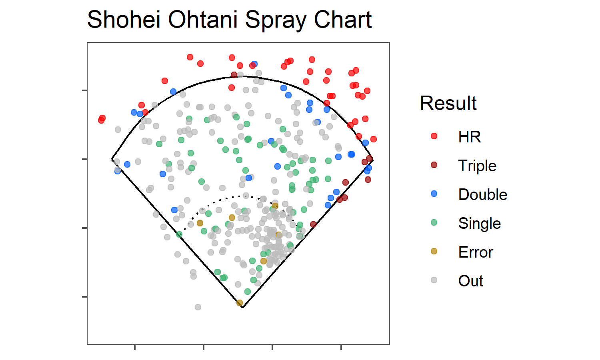
```

## ggplotの記法

- ggplot2パッケージの関数はやや特殊：たくさんの関数を「足し算」することでグラフに手を加えていく
- `ggplot` 関数で台紙を作る：どのデータフレームを使って可視化するのかもここで宣言

```{r, out.width="40%", fig.align='center'}
df <- palmerpenguins::penguins
ggplot2::ggplot(data = df) # この時点では白紙
```

## ggplotの記法 (cont'd)

```{r, out.width="80%", echo=FALSE, fig.align='center'}
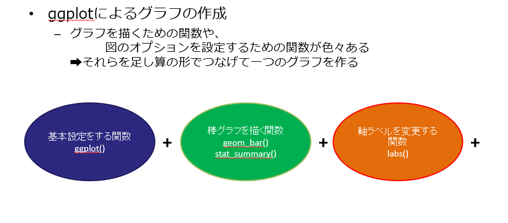
```


## 図形の描画：軸の設定

- 例として、ペンギンの体重のヒストグラムを作ろう：体重という1変数の分布を見る
- `aes`関数を使い、グラフの横軸・縦軸や色分けの情報を加えていく
  - 横軸: x, 縦軸: y, グループ分け: group, 色分け: colour, 塗りつぶし: shape, 形: shape あたりを覚えておく
  - 今回はヒストグラムなので、「横軸が体重ですよ」という情報を渡してやればよい
- その上で、ヒストグラムを描画する関数`geom_histogram`関数を加える

## ヒストグラムの描画
  
```{r, out.width="50%", fig.align='center'}
ggplot2::ggplot(data = df) +
  aes(x = body_mass_g) +
  geom_histogram()
```

## 細かな体裁の変更

- グラフの

## グループを分けて

# 分析と結果の表示

- 分析目的の設定
- 2群間の比較：$t$検定
- 最小二乗法
- 最尤法
  - ロジスティック回帰
- 分析の一例：CollegeDistanceデータを用いた分析
  
## 計量分析を行う


# RMarkdownを用いたレポートの作成

- Markdown形式のドキュメント
  - 数式フォントの利用
- コードブロックの作成
- htmlドキュメントの作成
- Wordファイルへの変換
- Powerpointファイルへの変換
- R Markdownを併用して論文作成・スライド作成の手間を省く

## Markdownとは

- 主にhtml(ウェブサイトなどで利用される形式)を手軽に出力するために考案された言語
- Rの結果出力などに特化した形式：R Markdown
  - ここではR Markdownについて扱う
  - htmlだけでなく、WordやPowerPointなど、使い慣れた形式にも変換可能
- 分析結果をいちいちスクリーンショットしたり、体裁を整えるために出力をやり直したりする必要がなくなる
  - 全てをR Markdownで完結させる必要はないので、例えば図や分析結果の出力をするためのWordファイルを作り、できたものをコピペするなどして使えば微調整も容易

# おまけ：バージョン管理

- 論文執筆・輪読の資料報告は班単位で行うので、スライドや分析結果を複数人で作成・共有する必要がある
- Dropbox, Github, Google Drive などでファイルごと共有しておくと、スライドをくっつけたり各自が修正したものをすり合わせる作業が削減できる、たぶん
- 覚えておいて損はないのでまあ興味があれば